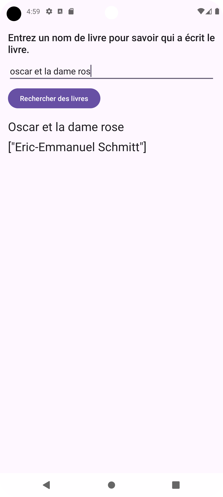

# Who Wrote It

Who Wrote It est une application Android qui permet de rechercher des informations sur des livres en utilisant l'API Google Books. L'utilisateur entre le titre ou le nom de l'auteur d'un livre, et l'application affiche le résultat le plus pertinent.

## Fonctionnalités

- Recherche de livres par titre ou auteur
- Affichage du titre et de l'auteur du livre trouvé

## Capture d'écran

